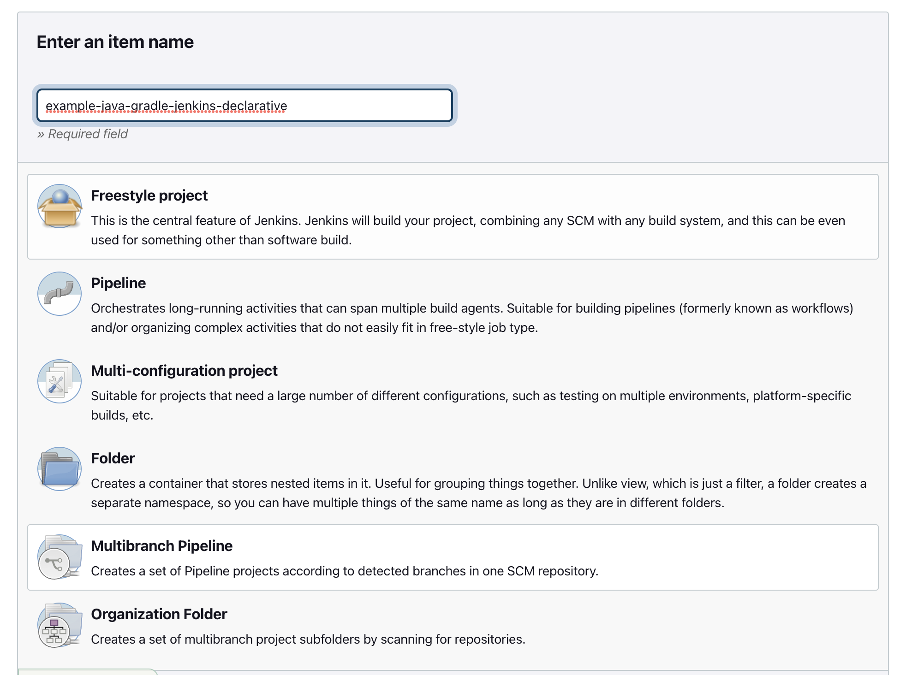
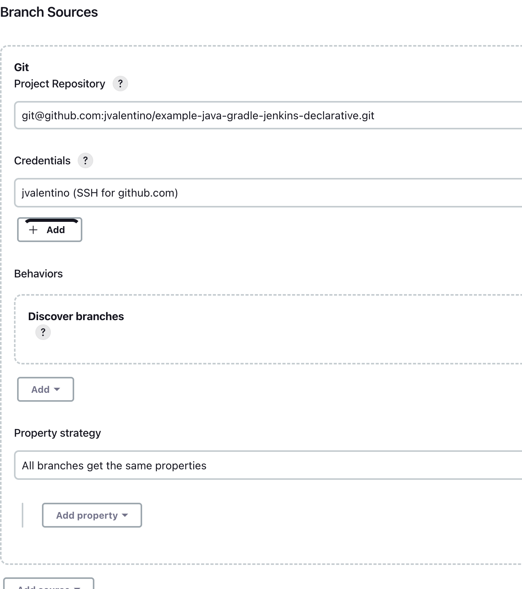
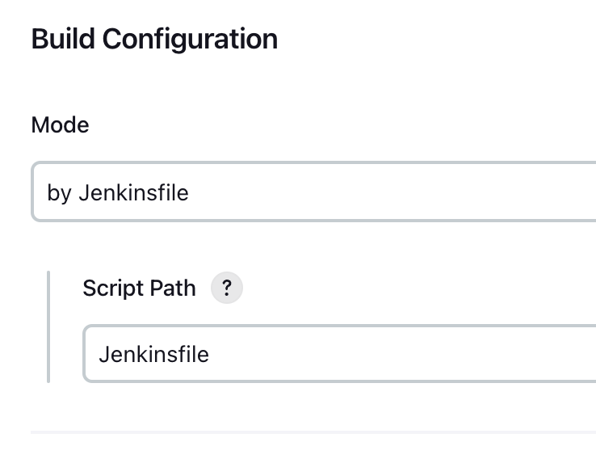
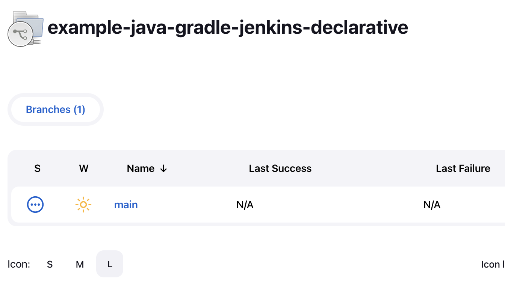
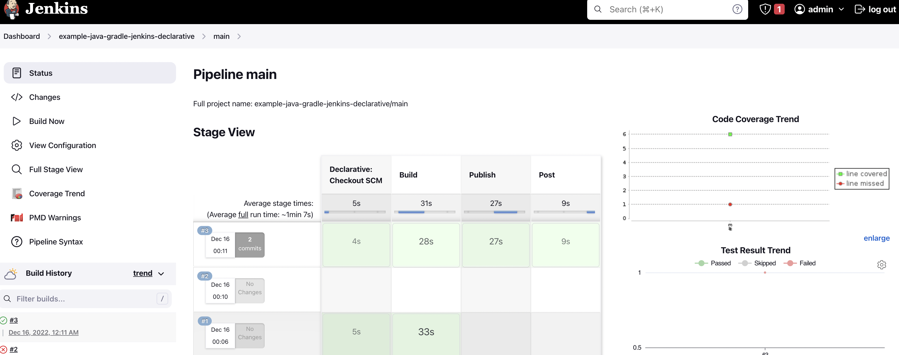

# Using a Declarative Pipeline to deliver Java Libraries with Gradle

Prerequisites

- Git Setup: https://github.com/jvalentino/setup-git
- Having setup Docker and Docker Compose: https://github.com/jvalentino/setup-docker
- Local Jenkins: https://github.com/jvalentino/example-docker-jenkins
- Building Java 101: https://github.com/jvalentino/java-building-101
- Gradle-Java Part 1: https://github.com/jvalentino/example-java-gradle-lib-1
- Gradle-Java Part 2: https://github.com/jvalentino/example-java-gradle-lib-2
- Gradle-Java Part 3: https://github.com/jvalentino/example-java-gradle-lib-3
- Gradle-Java Part 4: https://github.com/jvalentino/example-java-gradle-lib-4
- Jenkins-Freestyle: https://github.com/jvalentino/example-java-gradle-jenkins-freestyle
- Jenkins-Scripted: https://github.com/jvalentino/example-java-gradle-jenkins-scripted

# (1) The Declarative Pipeline

```groovy
pipeline {
  agent any

  stages {
    
    stage('Build') {
      steps {
        withGradle {
           sh './gradlew clean build --stacktrace -i'
        }
      }
    } // Build

    stage('Publish') {
      steps {
        withCredentials([usernamePassword(
        credentialsId: 'github-publish-maven', 
        passwordVariable: 'MVN_PASSWORD', 
        usernameVariable: 'MVN_USERNAME')]) {

          withGradle {
            sh """
              ./gradlew -i --stacktrace publish \
                  -PMVN_USERNAME=${MVN_USERNAME} \
                  -PMVN_PASSWORD=${MVN_PASSWORD} \
                  -PMVN_VERSION=1.${BUILD_NUMBER}
            """
          }  
        }
      }
    } // Publish

    stage('Post') {
      steps {
        script {
          jacoco()
          junit 'lib/build/test-results/test/*.xml'
          def pmd = scanForIssues tool: [$class: 'Pmd'], pattern: 'lib/build/reports/pmd/*.xml'
          publishIssues issues: [pmd]
        }
      }
    } // Post

  }
}
```


# (2) Initial Pipeline








# (3) Branch Scanning




# (4) The Pipeline Page




